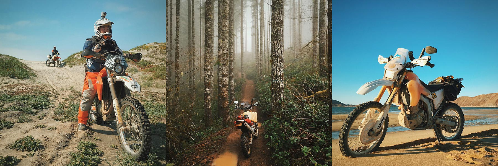
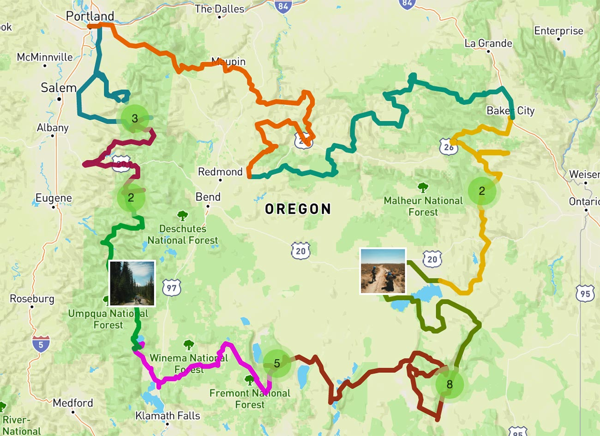

# My Tracks

Hi! In this repository lives the GPS tracks for trips I've taken on [my motorcycle](http://www.mytracks.co/). You are free to download and ride these yourself and can find photos from most of these trips on my Instagram account: 📷 [instagram.com/huntca](https://instagram.com/huntca/).

[](https://instagram.com/huntca/)

## How to load tracks

Tracks for any date can be loaded by providing the date (or date range) in the URL.

For example, from `2015-08-07` to `2015-08-15`, my wife and I rode a fun loop around Oregon. If we wanted to view those tracks, we provide that date range in the URL:

```
http://mytracks.co/map.html?2015-08-07..2015-08-15
```

Each track will be highlighted with a different (somewhat random) color on the map. If we don't like these random colors, we can specify our own:

```
http://mytracks.co/map.html?
  2015-08-07,ff0000&
  2015-08-08,f4006d&
  2015-08-09,f400d4&
  2015-08-10,9b00f4&
  2015-08-11,2800f4&
  2015-08-12,005cf4&
  2015-08-13,00a1f4&
  2015-08-14,00d4f4&
  2015-08-15,ba00ff
```

[](http://mytracks.co/map.html?2015-08-07,ff0000&2015-08-08,f4006d&2015-08-09,f400d4&2015-08-10,9b00f4&2015-08-11,2800f4&2015-08-12,005cf4&2015-08-13,00a1f4&2015-08-14,00d4f4&2015-08-15,ba00ff)

## Adding tracks

1. Separate and export each day's tracks into its own file using your tool of choice. I like to download and edit tracks using [Garmin's Basecamp](http://www.garmin.com/en-US/shop/downloads/basecamp).
1. Add the date of the track to the exported filename (`2015-10-12.gpx`).
1. Import the track using the script provided.

```bash
# This reduces the track to 250 points and copies it to /gpx
$ ./script/import-track /path/to/YYYY-MM-DD.gpx
```

## Adding photos

1. Resize the photos to 400px and export at 60% jpg to reduce filesize.
1. Add the date of the photo and number suffix to the filename (`2015-10-10-1.jpg`).
1. Move photos to `photos/`
1. Refresh photo list with provided script.

```bash
# This extracts the GPS information from every photo in photos/ and rebuilds
# the photo list in assets/js/map/photos.js
$ ./script/refresh-photos
```
